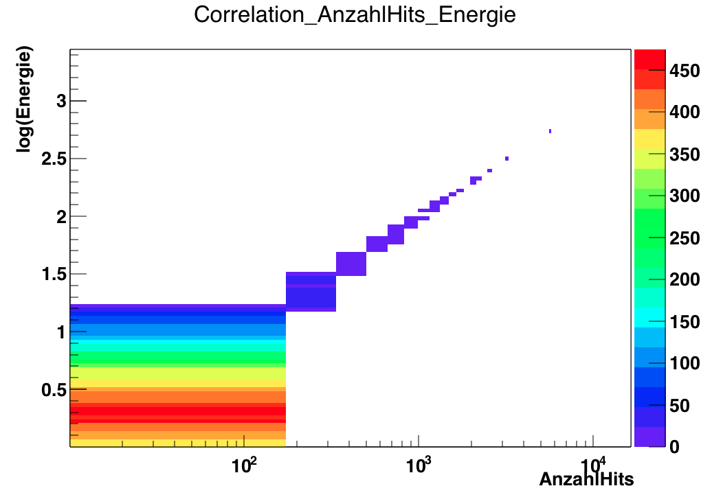
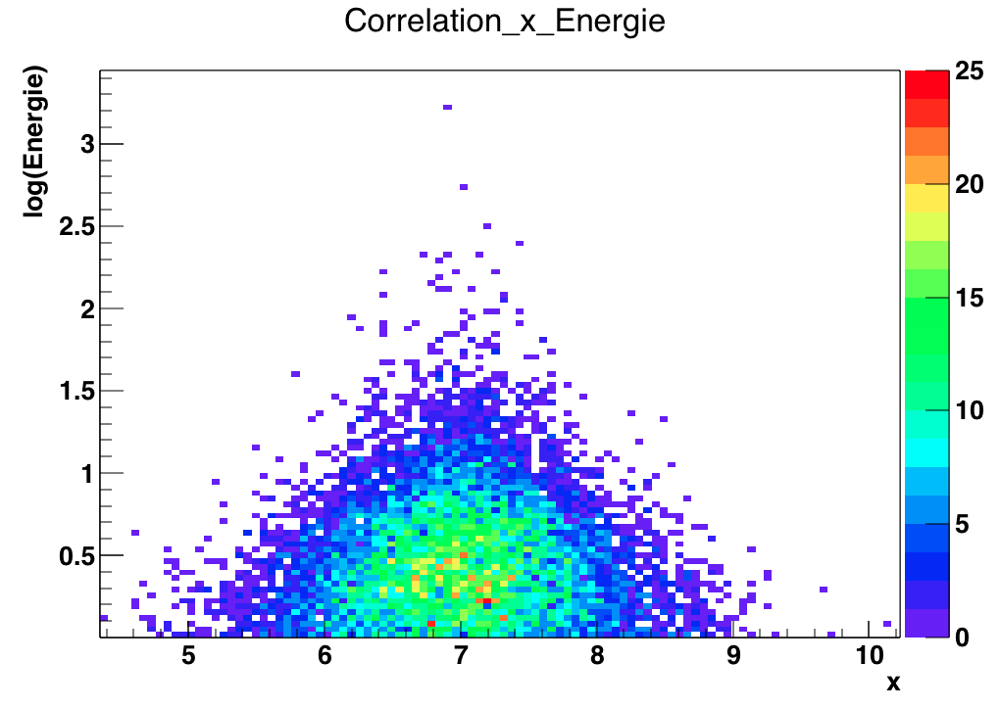
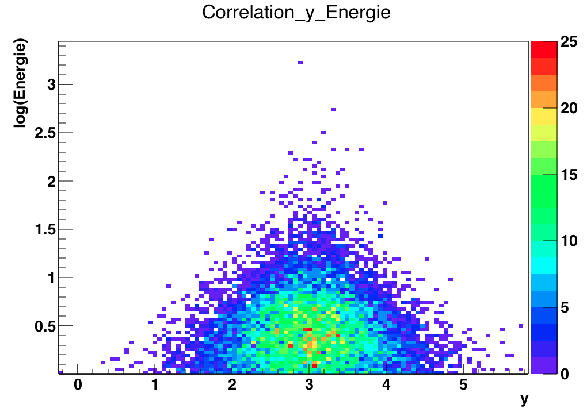
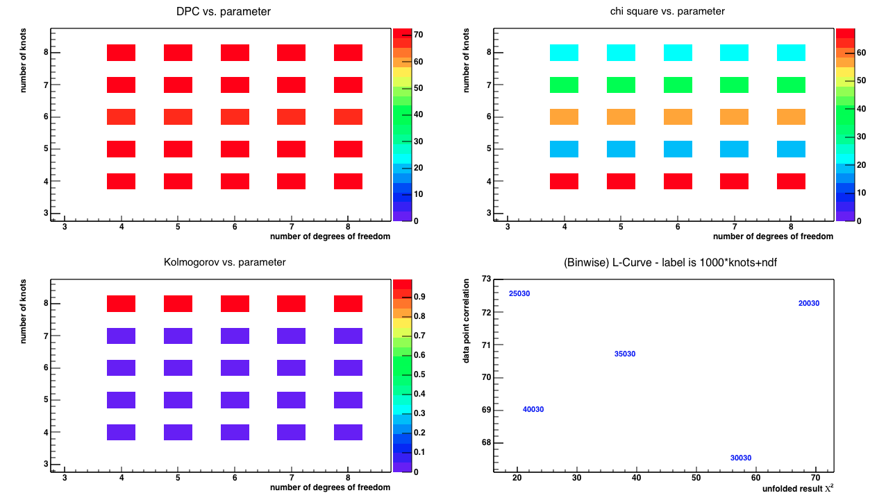
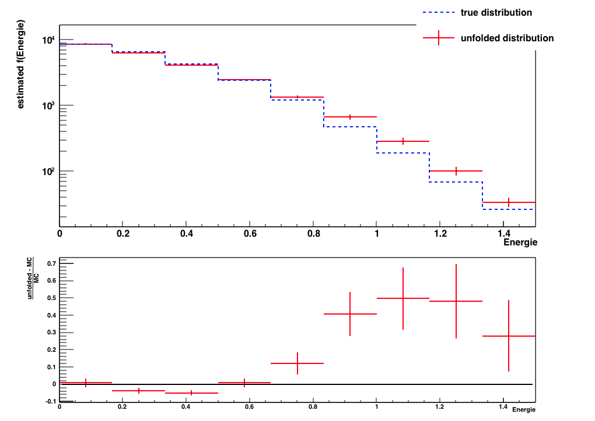

# Blatt 11

## Aufgabe 32

### a)

Der Tree mit dem Namen `Signal_MC_Akzeptanz` wird eingelesen
und mit der Variable `AnzahlHits` entfaltet.
Die Entfaltung soll im test modus ausgeführt werden mit einem
Daten/MC Verhältniss von 0.9. Die wichtigen Zeilen aus der `parameter.config`
lauten entsprechend

    mode: test

    pseudo_data_fraction: 0.9

    source_file_moca: ./Blatt7_TRUEE.root
    roottree_moca: Signal_MC_Akzeptanz

### b)

Die Anzahl der Bins wird über das Schlüsselwort
`number_bins` festgelegt. Der erlaubte Bereich der Zielvariable
soll zwischen 1 und 300 TeV liegen. Logarithmisch also von $log(1) = 0$
bis $log(300) \approx 2.5$. Die Vertielung soll in 9 Bins
verteilt werden. Die Zeilen aus der `parameter.config` dazu sehen wie folgt aus.

    branch_x: Energie log
    limits_x: 0 2.5

    number_bins: 9

Die Energie Verteilung folgt näherungsweise einer Exponentialverteilung. Durch das
logarithmieren wird die Verteilung annähernd linear. Dadurch werden die Ereignisse gleichmäßiger
auf die Bins verteilt.

### c)

Es werden die Observalblen `AnzahlHits`, `x`, `y` eingelesen. Die Ortsinformationen
zu logarithmieren macht keinen Sinn deshalb wird nur `AnzahlHits` logarithmisch eingelesen.
Damit die die Grammatik der Konfigurationssyntax auch ja nicht Kontextfrei bleibt
muss noch die Anzahl der eingelesenen Variablen und die Anzahl der Bins für jede Variable
 mit angegeben werden.

    number_all_variables: 3

    branch_y: AnzahlHits log
    number_y_bins: 9

    branch_y: x
    number_y_bins: 9

    branch_y: y
    number_y_bins: 9

### d)

Die Korrelationsplots nach der Entfaltung.

Offensichtilich erkennt man nur bei der Variable `AnzahlHits` eine Korrelation.
Im folgenden wird nur noch diese Variable benutzt.

### e)

Der Übersichtsplot zeigt die Werte verschiedener Teststatistiken bei verschiedenen
Parametern. In unserem Beispiel wurden über die Parameter wie folgt geloopt:

    number_deg_free: 4
    max_number_deg_free:  8

    number_knots: 4
    max_number_knots:  8

Wir nehmen das Parameterpaar welches möglichst kleine Werte für den Zweistichproben
KS-Test und den $\chi^2$-Test hat. Vorrausgessetzt der Übersichtsplot zeigt die tatsächlichen
Werte der Tests und nicht deren p-Wert ist, scheint in unserer Entfaltung das Wertepaar (5,5) gut zu sein.

In der Dokumentation zu TRUEE steht jedoch, dass ein Wert nahe 1 für den KS-Test ein gute
übereinstimmung zeigt. Das scheint aber nicht dem output der aktuellen Version zu entsprechen.

Das entsprechende Testresultat sieht wie folgt aus

### f)

Im Bereich von 1 bis 300 TeV sind 24926 Signaleeinträge im Baum.
Aus der Integration über die Enrgieverteilung mit einem Index von $-2.7$ folgt

$$
N \int_1^{300} E^{-2.7} dE \stackrel{!}{=} 24926 \implies N \approx 42390
$$

Da unser input logarithmiert war müssen wir die entsprechende Umkehrfunktion zum
10er Logarithmus berücksichtigen. Die Zeile aus der Konfigurationsdatei lautet also

    mc_func: 42390*pow(10,x)^(-2.7)

### g)
