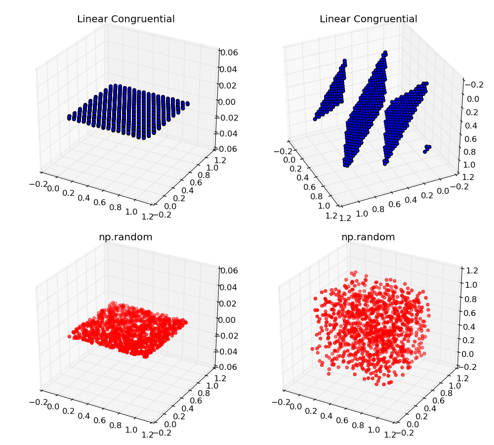

#Notizen zur SMD

## Numerische Grundlagen

### Zahlendarstellungen

Jede Zahl kann dargestellt werden mit  Vorzeichen, Mantisse, Basis und Exponent.

$$
  x = s \cdot  m \cdot  b^{e}
$$

Fließkommazahlen werden üblicherweise im IEEE754 Standard gespeichert.
Das Format erlaubt nur $b \in \{ 2, 10 \}  $. In alle landläufigen Systemen ist die
Basis gleich 2.
Das Format erzwingt die **eindeutige** Darstellung der Zahlen in dem die
Darstellung mit dem kleinsten Exponenten  gewählt wird.

Nach IEEE754 ist der Exponent immer positiv. Zum Exponent mit N Bits wird bei jeder Rechnung
einfach der Bias von $2^{N-1} - 1$ hinzuaddiert. Auf einen 8 Bit
Exponenten also einfach der Bias von 127 hinzuaddiert.

Vorsicht ist geboten da der Signifikant bzw. die Mantisse ein *implizites Bit*  versteckt.
Da durch die Wahl des minimalen Exponenten das führende
Bit der Mantisse immer 1 seien muss.

### Runden

Nach Vorlesung gilt

  >Eine Rundung heißt korrekt, wenn zwischen einer reellen Zahl $x$
  >und ihrer gerundeten Zahl $\tilde{x}$ keine Maschinenzahl liegt.

Rundungsfehler können sich im Laufe einer Rechnung fortpflanzen.
So spielt in manchen Fällen die Reihenfolge der Ausführung von Operationen
eine Rolle für die Genauigkeit des Ergebnisses. Auch wenn sie mathematisch
kommutieren.

### Kondition und Stabilität

Sei $f(x)$  eine bekannte analytische Funktion, $\tilde{f}(x)$ die numersiche
Näherung und $\tilde{x}$ die gestörte Eingabe. So gilt nach Dreiecksungleichung

$$
 \| f(x) - \tilde{f}(\tilde{x}) \| = \| f(x) - f(\tilde{x}) + f(\tilde{x}) - \tilde{f}(\tilde{x}) \| \leq \| f(x) - f(\tilde{x}) \| + \| f(\tilde{x}) - \tilde{f}(\tilde{x}) \|  
$$

Dabei nennt man $\| f(x) - f(\tilde{x}) \|$ die Kondition und $\| f(\tilde{x}) - \tilde{f}(\tilde{x}) \|$
die Stabilität.

Das Verfahren heißt stabil für Maschinengenauigkeit $\epsilon$ und relative Kondition
$\kappa$ wenn
$$
\exists \sigma \in \mathbb{R} :  \| f(\tilde{x}) - \tilde{f}(\tilde{x}) \| \leq \kappa \sigma \epsilon.
$$

Sei $f(x)$ differenzierbar in $x$ so lässt sich die relative Konditionszahl bestimmen über

$$
\kappa = \frac{ \| f^{\prime}(x) \|  \cdot \| x \|  }{\| f(x) \|}
$$

Für die Problem in der SMD reicht aber auch die einfach euklidische Metrik aus

$$
\kappa = \lvert \frac{  f^{\prime}(x)  \cdot  x   }{ f(x)} \rvert
$$

Ob ein gegbener Ausdruck numerisch Stabil aufgrund von Maschinenungenauigkeit ist
lässt sich nicht so einfach sagen. K.P. was die im Skript machen.

## Stochastik

Für die Kolgomorov Axiome benötigt man folgende Definitionen

  * Zunächst braucht man die Ergebnissmenge $\Omega$ , also die Menge der möglichen
    Ergebnissen eines Zufallsexperimentes. z.B $\Omega = \{Kopf, Zahl \}$

  * Dann den Ereignissraum $\Sigma$ welcher unter Mengenoperationen $\cup,  \cap, \setminus $
    abgeschlossen ist und $\Omega$ enthält. Häufig ist $\Sigma$ also einfach die Potenzmenge
    von $\Omega$
  * Ein $\sigma$-Maß  $P$ auf $\Omega$ welches in das Intervall $[0,1]$ abbildet.

Die Kolgomorov Axiome definieren den Begriff der Wahrscheinlichkeit:

  1. Ein Ereigniss $A \in \Sigma$ hat eine Wahrscheinlichkeit zugeordnet $0 \leq P(A) \leq 1$
  2. Für das sichere Ereigniss $\Omega$  gilt $P(\Omega) = 1$
  3. Für paarweise disjunkte $A_i \subset \Sigma $ gilt $P(A_1 \dot{\cup} A_2 \dot{\cup}\ldots) = \sum_i P(A_i)$

Eine wichtige Folgerung daraus ist die Wahrscheinlichkeit der Vereinigung mehrerer Ereignisse
die nicht Disjunkt sind. $P(A \cup B) = P(A) + P(B) - P(A \cap B)$. Es gilt also das
[Prinzip von Inklusion und Exklusion](http://de.wikipedia.org/wiki/Prinzip_von_Inklusion_und_Exklusion)

### Bedingte Wahrscheinlichkeiten

Die definition der Bedingten Wahrscheinlichkeit lautet:
$$
 P(A \vert B) = \frac{P(A \cap B)}{P(B)}
$$

Dies genügt den Kolgomorov Axiomen wenn $B = \Omega$ die neue Ergebnissmenge  ist.
(Da offensichtlich $P(B \vert B ) = 1$ etc ...)

Sind zwei Ereignisse unabhängig so gilt per definition der bedingten Wahrscheinlichkeiten $P(A) = P(A \vert B)$
Mit der Definition von oben gilt also sofort
$$
P(A \vert B) \cdot P(B) = P(A \cap B) = P(A)
$$

Larifaari ausgedrückt sind lassen sich unabhängige Ereignisse also miteinander Multiplizieren.

### Verteilungsfunktionen und Wahrscheinlichkeitsdichten
In den aller meisten Fällen lassen sich den Elementarereignissen $\omega \in \Omega$ Zahlen zuordnen.
Das erlaubt die Definition der Veteilungsfunktion und Wahrscheinlichkeitsdichten. Diese Zuordnung wird
Zufallsvariable gennant. Das wird im Skript komplett unterschlagen.
Sei $X$ also eine Zufallsvariable so lässt sich die Verteilungsfunktion definieren als:

$$
P(X \leq x) = F(x)
$$

Dabei ist $X$ die Menge der $\omega \in \Omega$  für die $X(\omega) \leq x $. Entsprechend folgt

$$
 P(X \geq x) = 1 - F(x)
$$

und

$$
P( a < t X \leq b) = F(b) - F(a)
$$

Wenn $F(x)$ stetig ist (siehe [Satz von Radon-Nikod](http://de.wikipedia.org/wiki/Satz_von_Radon-Nikod%C3%BDm))
, lässt sich die Wahrscheinlichkeitsdichte definitieren durch

$$
f(x) = \frac{d F(x)}{d x}
$$

Andersrum ausgedrückt
$$
F(x) = \int_{-\infty}^x f(x) dx
$$

Jetzt lassen sich Erwartungswerte für kontinuierliche und diskrete Zufallsvariablen definieren.

$$
E[g(X)] = \sum g(x) \cdot P(X = x)
$$

$$
E[g(X)] = \int g(x) \cdot f(x)
$$

Für alle vernünftigen Funktionen $g$. Der Erwartungswert ist eine Lineare Abbildung.

### Statistische Momente

Eng verwandt mit dem Erwartungswert sind die Momente. Das $k$-te Zentrale Moment für eine Zufallsvariable $X$
mit Erwartungswert $E(X) = \mu $ ist definiert als

$$
\mu_k(X) = E((X-\mu)^k )
$$

Für $k = 2$ wird das Moment auch Varianz $Var(X) = \sigma^2$ genannt.
Für die Varianz gilt der Verschiebungssatz (auch Satz von Steiner). Wir nutzen die Linerarität des
 Erwartungswertes um die eigenschaft zu zeigen.

$$
Var(X) = E((X - \mu)^2) = E(X^2 - 2 \mu X + \mu^2) = E(X^2) - 2 E(X) E(X)  + E(X)^2 = E(X^2) - \mu^2
$$

Für $k=3$ wird die Größe Schiefe (Skewness) und für $k=4$ Wölbung (Kurtosis) genannt.
Häufig werden die Größen in Einheiten der Standardabweichung angegeben. Also jeweils noch
durch $\sigma^k $ geteilt. In der Vorlesung auch.

### Quantile
Quantile einer Zufallsvariable lassen sich sehr einfach mit der Verteilungsfunktion definieren.
Das Quantil $x_q$ ist der Wert für den gilt

$$
F(x_q) = P(X < x_q)  = \int_{-\infty}^{x_q} f(x) dx = q
$$

## Diverse Verteilungen

Es folgt eine Sammlung von wichtigen Veteilungen und deren Eigenschaften

### Stetige Gleichverteilung

*  Dichtefunktion  $f(x) = \frac{1}{b-a}$
*  Erwartungswert  $E(X) = \frac{b-a}{2}$

### Dreiecksverteilung und

Entsteht durch eine Zufallsvariable $S = X_1 +  X_2$ wenn $X_1, X_2$ aus einer gleichverteilung Stammen.
Die Dichtefunktion ist kompliziert. Der Erwartungswert bleibt aber bei  $E(S) = \frac{b-a}{2}$

### Normalverteilung und Zentraler Grenzwertsatz
Die Wahrscheinlichkeitsdichte der Normalverteilung lautet
$$
f(x) = \frac{1}{\sigma \sqrt{2 \pi}} e^{- \frac{1}{2} \frac{(x - \mu)^2}{\sigma^2}}
$$
Dabei ist der Parameter $\mu$ der Erwartungswert und $\sigma^2$ die Varianz der Verteilung.

Wie bei jeder symmetrischen Verteilung sind all ungeraden (zentralen) Momente der Verteilung gleich 0.
Das zweite zentrale Moment der Veteilung ist logischerweise $\sigma^2$
An dieser Stelle sollte man auf den [Zentralen Grenzwertsatz](http://de.wikipedia.org/wiki/Zentraler_Grenzwertsatz) hinweisen.

### Die $\chi^2 $-Verteilung

Eine $\chi^2$-Verteilung mit $n$ Freiheitsgraden entsteht aus der Summe von $n$ quadrierten
unabhängig standardnormalverteilten Zufallsvariablen $Z_i^2$. Der einzige Parameter der
Verteilung ist $n$. Dichte und Verteilungsfunktion sind komplizierte Ausdrücke mit Gamma Funktionen.
Wichtig sind eher

 * Erwartungswert  $E(\chi_n^2) = n$
 * Varianz t  $Var(\chi_n^2) = 2n$

Die Summe von $\chi^2$ Verteilungen ist wieder $\chi^2$ verteilt.

## Zufahlszahlen und Verteilungen

Wichtige Kriterien für PRNGs nach Vorlesung lauten

 * Reproduzierbarkeit. Sowieso gegeben bei deterministischen Rechnern
 * Geschwindigkeit. Zumindest bei wissenschaftlichen Anwendungen wichtig. Bei Kryptographie ist das etwas subtiler.
 * Periodenlänge. Also die Minimale Folgenlänge nach der sich die Zahlen wiederholen

### Linear Congruential

Die defintion der folgenglieder erfolgt rekursiv aus dem vorherigen Element.

$$
x_{n + 1} = (a x_n + c) \mod M
$$

Die maximal erreichbare Periodenlänge ist klarerweise $M$. Diese wird aber nuch für bestimmte Werte von
$a$ und $c$ erreicht. Nach Knuth gelten dafür folgende Bedingungen:

 * $c$ und $M$ sind Teilerfremd
 * $a- 1$ ist teilbar durch jeden Primfaktor von $M$
 * Wenn $M$ durhc 4 teilbar ist, dann auch $a -1$

 Der  Multiplicative Linear Congruential hat keinen Inkrement. Also $c = 0$. Die Periodenlänge ist immer kleiner als die des Linear Congruential.
 Er erreicht seine maximale Prediodenlänge iff

  * Der Startwert $x_1$ ist Teilerfremd zu $M$
  * $a$ ist primitives Element der Restklassengruppe   $\mathbb{Z} \setminus M\mathbb{Z}_\times $ .
    Also mit Multiplikation

Zum einfachen testen der Güte von Zufallszahlen könnte man einfach alle Zahlen Histogramieren und prüfen ob eine
Gleichverteilung entsteht. Das reicht aber nicht aus da evetnuell Lücken im Wertebereich nicht auffallen aufgrund
des Binnings. Außerdem wird die Reihenfolge der Zahlen nicht getestet die ebenfalls korreliert sein kann.
Bei Linearen Kongruenzgeneratoren kann man die Korrelation zwischen den Folgegliedern prüfen mittels Spektraltest.
Dazu werden Tupel von Zahlen (zum Beispiel auffeinander folgende) aufgetragen. In -Aufgabe 13 von Blatt 4 sah das zum Beispiel so aus.

### XOR-Shift

Dieser Algorithmus nutzt nur wenige XORs und Bitshifts während der Berechnung eines Folgendgliedes und ist
deshalb besonders effektiv auf entsprechender Hardware. Die Funktionsvorschrift der Variante aus der Vorlesung
für eine Seed $x$ lautet

$$
x = (y_i << a) \otimes x
$$

$$
x = (y_i >> b) \otimes x
$$

$$
y_{i +1} = (y_i << c) \otimes x
$$

Die 32-Bit version hat eine Maximale Periodenlänge von $2^{32} - 1$.

### Mersenne Twister
Der Mersenne Twister ist ein weit verbreiteter Algorithmus mit ähnlicher Güte wie der XOR-Shift.
Braucht 624 Startwerte und liefert pro durchlauf weitere 624 Zahlen.

## Erzeugen beliebiger Verteilungen.

Die meisten PRNGs erzeugen gleichverteilte Zahlen. In der Praxis braucht man aber meistens Zahlen
aus anderen Verteilungen. Es je nach Zielverteilung verschiedene Methoden um das zu erreichen.

### Neumansches Rückweisungsverfahren (Rejection Method)

Ziehe zunächst Paare von Zufallszahlen $(x_r, y_r)$ aus dem Definitionsbereich einer
gegebene Wahrscheinlichkeitsdichte $f(x)$. Bilde nun für all $x_r$ die  $y_{r, neu} = f(x_r)$. Falls
$y_r < y_{r,neu}$  behalte $x_r$ andernfalls verwerfe das Zahlenpaar.

Das Verfahren ist relativ einfach zu handhaben und funktioniert für beliebige Verteilungen.
Die Laufzeit ist dafür natürlich eher schlecht da viele Zahlen verworfen werden. Besonders in höher dimensionalen
Räumen ist das ein Problem da das Volumen unter der Kurve der Wahrscheinlichkeitsdichte kleiner wird.

Im Mittel wird so nur jede

$$
Q = \frac {\int_\Omega f d \Omega}{\Omega}
$$

Zahl genutzt.

### Transformationsmethode

Angenommen eine stetige Verteilungsfunktion $F(x)$ besitzt eine Umkehrfunktion und $U$
sei eine auf dem Interval $[0,1]$ gleichverteilte Zufallsvariable. Dann genügt $X:=F^{-1}(U) $
der Verteilungsfunktion $F(X)$ wenn $F^{-1}$ die bekannte Quantilsfunktion ist. Siehe abschnitt weiter oben.

>Generation von Zufallszahlen im Bereich von 0 bis $\pi$, die der
>Wahrscheinlichkeitsdichte f(x)=sin(x) folgen

Das ist nun leider keine Wahrscheinlichkeitsdichte.  Dafür aber $f(x)=\frac{sin(x)}{2} $.

Bestimme also zunächst die Verteilungsfunktion $F(x) = \int_{-\infty}^x f(x) dx$ in dem Defintionsbereich von
$[0,\pi]$

$$
F(x) = \int_{-\infty}^x \frac{sin(x)}{2}  dx = \frac{1 - \cos(x)}{2}
$$

Dann folgt für $F^{-1}(U) $ nämlich (also nicht wie im Skript. Da isses falsch)

$$
X = F^{-1}(U)  = \arccos(1 - U\cdot2)
$$

Das funktioniert auch. Beweis durch Plot.

### Erzeugung Normalverteilter Zahlen

Da die Verteilungsfunktion der Normalverteilung oder deren Inverse nicht mehr analytisch
aufgeschrieben werden kann, funktioniert die Inversionsmethode hier nicht. Stattdessen nutzt
man die Box Muller Methode oder die Polarmethode. Das sind zwei ähnliche aber doch unterschiedliche
Algorithmen. In der Vorlesung steht ganz ganz seltsames Zeug dazu. Da scheinen beide Methoden
vermischt zu werden.

Beide Verfahren beruhen auf dem Polarkoordinaten Trick zur Berechnung des Gaußintegrals.
Um die Inversionsmethode anwenden zu können bräuchte man einen analytischen Ausdruck für die
Verteilungsfunktion der Normalverteilung. Die gibt es aber nicht. Da das Integral
$$
I  = \int_{-\infty}^{\infty} e^{- \frac{x^2}{2}} dx
$$
nicht ohne weiteres Lösbar ist.

Das Produkt von zwei Gaußintegralen lässt sich allerdings doch integrieren.

$$
I^2 =  \int_{-\infty}^{\infty} e^{- \frac{x^2}{2}} dx \cdot  \int_{-\infty}^{\infty} e^{- \frac{y^2}{2}} dy
$$
$$
I^2 =   \int_{-\infty}^{\infty} \int_{-\infty}^{\infty} e^{- \frac{(x^2+ y^2)}{2}} dx dy
$$
In Polarkoordinaten folgt.

$$
I^2 =   \int_{0}^{\infty} \int_{0}^{2\pi} e^{- \frac{r^2}{2}} r dr d\varphi = 2\pi  \int_{0}^{\infty} e^{-
  \frac{r^2}{2}} r dr = 2\pi
$$

#### Box Muller  Methode

Ziehe zunächst gleichverteilte Zufallszahlen $u_1, u_2$ aus dem Intervall $[0, 1]$.
Für die Inversions Methode muss eine Verteilungsfunktion bestimmt werden. Betrachten wir also die
neue Wahrscheinlichkeitsdichte $f(x,y) =  e^{- \frac{(x^2+ y^2)}{2}} \cdot \frac{1}{2\pi} $. Also das Produkt
aus zwei Normalverteilungen.

Nach der Transformation in Polarkoordinaten wie oben erkennt man , dass der Polarwinkel $\varphi$ gleichverteilt
im Interval $[0, 2\pi]$ ist da die Verteilung radialsymmetrisch ist. Entsprechend kann dieser Parameter schonmal
erzeugt werden durch

 $$
 \varphi = 2\pi u_1
 $$

Übrig bleibt der Radius R. Mit der Definiton der Verteilungsfunktion folgt also das Integral

$$
F(R) = \int_{0}^{R} e^{- \frac{r^2}{2}} r dr = 1 - e^{-\frac{R^2}{2}}
$$

Und die Umkehrfunktion $F^{-1}(u_2) = \sqrt{-2 \ln(1- u_2)} $ die sich äquivalent schreiben
lässt als $F^{-1}(u_2) = \sqrt{-2 \ln(u_2)} $ da die Verteilungen $1-u_2$ und $u_2$ gleich sind.
In kartesischen Koordinaten folgt demnach

$$
  z_x = R \cdot \cos(\varphi) = \sqrt{- 2 \ln(u_1) } \cos(2 \pi u_2)
$$
$$
  z_y = R \cdot \sin(\varphi)  =  \sqrt{-2 \ln(u_1) } \sin(2 \pi u_2)
$$

Der Grund für die Erzeugung von Zahlenpaaren ist auch technischer natur. So lassen sich auf vielen
Prozessoren der Cosinus und der Sinus für ein Register paralell mit einer einzigen Assemblerinstruktion
berechnen.

#### Marsaglias Polar Method

Hierbei werden die Bestimmung der trigonometrischen Ausdrücke überflüssig. Was eventuell zur schnelleren
Ausführung hilft. Hier der
[Algorithmus wie in der Wikipedia](http://de.wikipedia.org/wiki/Polar-Methode) beschrieben ist:

   >1.  Erzeuge zwei voneinander unabhängige, gleichverteilte Zufallszahlen $u, v$ im Intervall $[-1, 1]$
   >2.  Berechne $q=u^2+v^2$. Falls $q = 0$ oder $q \geq 1$, gehe zurück zu Schritt 1.
   >3.  Berechne $p = \sqrt {\frac{-2 \cdot \ln q}{q}}$.

   >$x_1=u \cdot p $ und $x_2=v \cdot p $ sind nun zwei voneinander unabhängige, standardnormalverteilte Zufallszahlen.

### Erzeugung $\chi^2$-verteilter Zahlen.

Ein Wikipdia sagt mehr als 1000 worte:

> Für gerade n=2m kann man die $\chi_n^2$-Verteilung als m-fache Faltung bilden mit Hilfe der gleichmäßig stetigen Dichte $U(0,1)$:

>   $\chi_n^2 = -2\ln{\left(\prod_{i=1}^m u_i\right)}=-2\sum_{i=1}^m \ln(u_i)$,

> worin die u_i m unabhängige gleichmäßig stetig verteilte Zufallsvariablen sind.

>Für ungerade $n$ gilt dagegen

>  $\chi_n^2 = \chi_{n-1}^2 + \left[\mathcal{N}(0,1)\right]^{2}. $

Beweis erfolgt mal wieder durch Plot.

## Trennen von Datensätzen
Die Standardaufgabe in der Physik ist die Trennung von Signal und Untergrund in seinen Messdaten.
Dafür gibt es diverse Verfahren. Allen gemeinsam ist die Messung der Trennungsqualität über
die Zahlen aus der ConfusionMatrix. Um statistische Fehler zu bekommen und Overfitting zu vermeiden werden
Resampling Methoden wie k-Fold Cross Validation und Bootstrapping verwendet.

### Lineare Fischer Diskriminanz
Vorsicht. Allgemeine  LDA und Fisher Diskriminanz machen unterschiedliche Annahmen an die Varianzen in den Klassen.
Wird aber haüfig nicht unterschieden.

Gegeben seine $N$ Beobachtungen $\vec{X} $ wobei jede Vektorkomponente $\vec{X}_k $eine Eigenschaft/Feature/Parameter oder wie
auch immer ist. Die Trainingsmenge sind die Tupel $(\vec{X}, y)$ wobei $y$ die Zufallsvariable ist welche
die Klassenzugehörigkeit codiert.

Die Entscheidungsfunktion für irgendeine Beobachtung $\vec{X}^{(i)}$ bei LDA sieht allgemein einfach so aus:

$$
\vec{w} \cdot \vec{X}^{(i)} > c
$$

Sei $V_y$ die Kovarianzmatrix der jeweiligen Klassenrealisierung $y$. Zunächst in Komponentenschreibweise

$$
V_{k,l} = \frac 1N  \sum_N (\vec{X}_k - \vec{\mu_X}_k) (\vec{X}_l - \vec{\mu_X}_l)
$$

Wenn $\underline{X}$ die Matrix aller Beobachtungen ist und $\underline{\mu_x}$ die Matrix der Mittelwerte
für jedes Feature (in jeder Zeile stehen die selben Werte) dann gilt in Matrix schreibweise

$$
V = \frac 1N (\underline{X} - \underline{\mu_x})^T  \cdot (\underline{X} - \underline{\mu_x})
$$

Der Gewichtsvektor $\vec{w} $ wird dann gebildet mit

$$
\vec{w}  = ( V_{y_1} + V_{y_2} )^{-1} (\underline{\mu_{x, y_2}} - \underline{\mu_{x, y_1}})
$$

Wie die Schwelle $c$ definiert ist, ist nicht ganz eindeutig und sollte je nach Problem unterschiedlich gewählt
werden. Falls sich die Verteilungen für die Klassen der $c \cdot \vec{w}$ Projektion einigermaßen ähnlich sehen
so ist nach [Wiki](http://en.wikipedia.org/wiki/Linear_discriminant_analysis) folgende Wahl gut

$$
c = \vec{w} \frac12 (\vec{\mu}_{x, y_1} + \vec{\mu}_{x, y_2})
$$

Häufig möchte man die Projektion auch einfach nur Plotten und eine Schwelle festlegen. Folgendes Beispiel
soll das Illustrieren.

    import numpy as np
    from sklearn.datasets import make_classification

    X, Y = make_classification(n_samples=1000, n_features=10, n_redundant=0, n_informative=4,
                                 n_clusters_per_class=1)

    class_1 = X[Y == 1]
    class_2 = X[Y == 0]

    mu_1 = np.mean(class_1, axis=0)
    mu_2 = np.mean(class_2, axis=0)

    variance_1 = np.dot((class_1 - mu_1).T, (class_1 - mu_1))
    variance_2 = np.dot((class_2 - mu_2).T, (class_2 - mu_2))

    weights =np.dot( np.linalg.inv(variance_1 + variance_2)  ,  (mu_2 - mu_1))

    c = np.dot(weights , (mu_1 + mu_2)) * 0.5

Das führt zu folgendem Plot

##Dimensionsreduktion

### Hauptkomponentenanalyse, PCA

Wird vor allem zur Dimensionsreduzierung verwendet. Datensätze mit mehreren tausend Attributen
treten zum Beispiel in der Bildverarbeitung (siehe auch Eigenfaces) und der Biologie häufig auf.
Oft sind viele dieser Attribute extrem korreliert und können quasi *zusammengefasst* werden.
Ziel der PCA ist es die Achse im Raum zu finden entlang derer die Varianz am größten ist.
Das wird die erste Hauptkomponente genannt. Die zweite Hauptkomponente ist entsprechend
die Achse mit der zweitgrößten Varianz etc.
Klingt kompliziert lässt sich aber einfach durch Eigenwertzerlegung bestimmen.
Die tatsächliche Theorie dahinter kann beliebig kompliziert werden. Hier wird nur das Verfahren
und das Resultat erläutert.

Seien zunächst o.B.d.A. $N$ **zentrierte** Zufallsvariablen $\vec{X}^{(i)}$ als Datenmatrix $\underline{X}$
gegeben.

  1. Berechnung der Kovarianzmatrix der Daten $C = \frac{1}{N-1} \underline{X}^T \underline{X}$
  2. Diagonalisiere $C$ durch Zerlegung in $V^{-1}CV = D$ mit beliebiger Methode. In $V$ stehen jetzt also die Eigenvekoren $\vec{V}^{(i)} $
  3. Transformiere die Datenmatrix in die Eigenbasis der Kovarianzen $\vec{Z}^{(i)} = \underline{X}  \vec{V}^{(i)} $

Zur Reduktion der Dimension behalte man nur die $\vec{Z}^{(i)}$ zu den Eigenvektoren $ V^{(i)} $  deren Eigenwerte
größer als ein bestimmter Schwellwert war.

Die PCA eines 2D Gauß kann zum Beispiel so aussehen.

### MRMR
Wat soll man dazu sagen?

## Transformation und Fehlerfortpflanzung

Transformieren man eine Wahrscheinlichkeitsdichte $f(x), x  \in \mathbb{R}^n$ mit $g(y) = x,  g:\Omega \rightarrow \mathbb{R}^n$ so gilt auch hier der
 [Transformationssatz](http://de.wikipedia.org/wiki/Transformationssatz)
$$
 \int_{g(\Omega)} f(x) dx = \int_\Omega f(g(y)) \det [Dg(y)]  dy  
$$
mit der Determinante  der Jacobi Matrix $Dg(y)$ an der Stelle $y$.

Im Blobel steht das ganze etwas salopp ungefähr so. Man verlangt eine "flächentreue" Abbildung
zwischen den Wahrscheinlichkeitsdichten $f_y(y)$ und $f_x(x)$ wenn eine Abbildung $g(y) = x$
gegeben ist.
$$
f_y(y) = \sum_{\text{Zweige}} \frac{f_x(g(y))}{\lvert dx/dy \rvert }
$$
Wie genau diese Definiton zu verstehen ist weiß ich auch nicht. Vor allem da nach Transformationssatz die
$g(y)$ eindeutig exestieren muss glaub ich. Keine Ahnung.

Sei zum Beispiel ein Wahrscheinlichkeitsdichte $f(x)$ gegeben zusammen mit einer Transformation
$g(y) = \sqrt{y} = x$. Dann enthält $Dg$ nur das Element $\frac{1}{2\sqrt{y}} $ Im Blobel passiert an dieser Stelle Magie. Egal!

Was bedeutet das für die Fehlerforpflanzung. Eher unklar. Zunächst ist das Wort Fehlerforpflanzung extrem
gefährlich da Messfehler oder gar systematische sich Fehler unabhängig von der zugrunde liegenden
Wahrscheinlichkeitsdichte der Messgröße propagieren. Wir können tatsächlich *nur* die Kovarianzmatrix
transformieren. Diese können wir aus unseren Messungen natürlich schätzen.

### Lineare Transformation

Allgemein gilt gegeben eine Zufallsvariable $X$ mit Kovarianzmatrix $V_X$ und eine lineare Abbildung
$f =A X$, so gilt für die Transfomation der Kovarianz

$$
V_f = A V_X A^T
$$

Auch wenn es keine Korrelationen in $X$ gibt, $V_X$ also Diagonal ist,  so muss $V_f$ nicht unbedingt Diagonal
sein.

Der Erwartungswert ist eine lineare Abbildung. Demnach gilt:
$$
E[f(X)] = E[A X] = A E[X]
$$

### Nicht lineare Transformation

Sei $f(X)$ irgendeine nicht-lineare Funktion die unsere Zufallsvariable $X$ transformiert. Die Taylor Näherung
in erster Ordnung um den Mittelwert $\mu$ lautet dann

$$
f \approx f(\mu) + Df \cdot (x -\mu)
$$

mit Jacobi Matrix $Df$. Die Konstante $f(\mu)$ hat keinen einfluss auf die Kovarianz der Zufallsvariable
in der Transfomation. So ergibt sich die neue Kovarianzmatrix wie im linearen Fall oben  wieder einfach zu

$$
V_f =  Df  V_x Df^T
$$
In der Vorlesung heißt die Matrix $B$ und das ganze wird zur Großkreutzschen Forlmel:

$$
V_f = B V_x B^T
$$

In den allermeisten Fällen ist die Funktion $f$ jedoch ein Skalarfeld. Zum Beispiel die indirekte Messung einer
Größe durch zwei andere Größen, wie etwa den Widerstand über die Spannung und den Strom.
Ein Beispiel mit einer Skalaren Funktion $f: \mathbb{R}^2 \rightarrow \mathbb{R}$ und einer zentrierten
Zufallsvariable $X = (x,y)^T $ kann so aussehen:

$$
f \approx  f(0) + \text{grad f}  \cdot X = f(0) + \frac{\partial f}{\partial x} x + \frac{\partial f}{\partial y}y
$$

Da die Jacobi Matrix für skalare Felder zum Gradienten wird.
Mit der Kovarianzmatrix
$$
V_x =         \begin{pmatrix}
        \sigma_x^2 & \sigma_{xy} \\
        \sigma_{xy} & \sigma_y^2
        \end{pmatrix}
$$

folgt für die transformierte Varianz

$$
\sigma_f^2  = \begin{pmatrix}
           \partial_{x} f\\
           \partial_{y}f
        \end{pmatrix}
        \cdot
        \begin{pmatrix}
        \sigma_x^2 & \sigma_{xy} \\
        \sigma_{xy} & \sigma_y^2
        \end{pmatrix}
        \cdot
        \begin{pmatrix}
                   \partial_{x} f\\
                   \partial_{y}f
          \end{pmatrix}
          = (\partial_x f)^2  \sigma_x^2 + (\partial_y f )^2  \sigma_y^2 + 2 \partial_x \partial_y \sigma_{x,y} f
$$

Diese Form ist auch als  Gaußsche Fehleforpflanzung bekannt.

## Schätzen

Schätzer werden benutzt um unbekannte Parameter der Grundgesamtheit die einer Messung
zugrunde liegt zu berechnen.  Seien beispielsweise Werte einer Messung normalverteilt mit
unbekannten Parametern so lassen sich bei ausreichender Stichprobengröße Varianz und Mittelwert
der Verteilung schätzen. Es gibt verschiedene kenngrößen um Schätzer zu kategorisieren.

Sei $\hat \theta$ der geschätzte Wert zum wahren Wert $\theta$.

 * Der Schätzer heißt Erwartungstreu wenn $E[\hat \theta]  = \theta $
 * Der Schätzer hat den  Bias wenn  $B(\theta) = E[\hat \theta]   -  \theta$
 * Den $MSE(\theta) = E[(\hat \theta - \theta)^2] = B(\hat \theta)^2 + Var(\hat \theta)$

So ist das arithmethische Mittels beispielsweise ein erwartungstreuer Schätzer für den wahren Mittelwert.
Die einfache Formel für die Varianz dagegen ist verzerrt. Weshalb man häufig die korrigierte Stichprobenvarianz
$S^2$ benutzt welche wieder Erwartungstreu ist.

 $$
S^2 = \frac {1}{n-1} \sum_{i = 0}^n (x_i - \bar x)
 $$

 ### Kleinste Quadrate Methode

 Betrachtet man seine Messungen $x_i, y_i, z_i \ldots $ als Realisierung von Zufallsvariablen und möchte daraus
 die Parameter aus dem Parametervektor $a$ eines funktionalen Zusammenhangs $y = f(x,y,z,\ldots, a) \in \mathbb{R}^N$
 schätzen. Hier minimiert man einfach die Summe der Quadratabweichungen oder auch Residuen.

$$
\min_a \sum_i (y_i -f_i(x_i, y_i, z_i \ldots,  a) )^2 = \min_a \sum r_i^2 = \min_a \| y - f \|_2^2
$$

Um das Residuum zu minimieren muss die Ableitung 0 werden
$$
\frac{\partial }{\partial a_j} \sum (y_i - f_i(x_i, y_i, z_i \ldots,  a))^2 = - 2 \sum r_i \frac{\partial f_i(x_i, y_i, z_i \ldots,  a)}{\partial a_j} \stackrel{!}{=} 0
$$

Die Minimierung kann aber über beliebiges Verfahren erfolgen. Der Vorteil dieser Methode liegt darin, dass
man keine Annahme über die Verteilung der Zufallsvariablen machen muss.

#### Linear Least Squares

Wichtiger Spezialfall sind jedoch Lineare Modelle. Die sich häufig analytisch lösen lassen.
Also Funktionen $f = \sum_k a_k \phi_k(x,y,z, \ldots)$ die nur linear in den Parametern $a_i$ sind.
Die Ableitung wird so zu
$$
X_{k,i} = \frac{\partial f_i(x_i, y_i, z_i,  \ldots ,a)}{\partial a_k} = \phi_k(x_i, y_i, z_i, \ldots)
$$

Setzt man diesen Spaß in die Gleichung der Ableitung ein kommt man auf die
wichtige Matrixgleichung als Schätzer für $a$

$$
(X^T X )^{-1}  X^T y  = \hat a
$$

Die Fehler auf die geschätzten Paramater $a$ erhält wie zuvor aus der Transfomation der Kovarianzmatrix
$V_y$ die wir aus unserer Messung gewinnen können.

$$
V_{\hat a} = (X^T X )^{-1}  X^T V_y ( (X^T X )^{-1}  X^T)^T
$$

#### Weighted Linear Least Squares

Manchmal ist es wünschenswert verschiedene Messungen seiner Stichprobe unterschiedlich zu gewichten.
Im Optimalfall nimmt man dafür den Kehrwert der Varianz der Messung. Die ist in der Praxis aber eher
selten bekannt. Aber häufig proportional zum gemessenen Wert.

######  Beispielrechnung aus der Übung

Gegeben sei das Modell $f = a_1 \cos(x) + a_2 \sin(x)$ wobei $f \in \mathbb{R}^N$ und $N$ Messungen.
Die Residuen  $\| f- y \|_2^2$ sollen minimiert werden. Zunächst in Komponentenschreibweise

$$
\sum_i (f_i(x,  a) - y_i)^2 = \sum_i (a_1 \cos(x_i) + a_2\sin(x_i) - y_i)^2
$$

Das Residuum $r_i  = a_1 \cos(x_i) + a_2\sin(x_i) - y_i $ lässt sich in Matrixschreibweise hinschreiben als
$r = X a - y$. Mit der Matrix

$$
X = \begin{pmatrix}
    \cos(x_1) & \sin(x_1) \\
    \cos(x_2) & \sin(x_2)
  \end{pmatrix}
$$

..ewig lang alles glaub ich

### Maximum Likelihood Methode

Man hat $N$ unabhängige  Messungen von Variablen (Vektoren) $X_i$ als Realisierung einer Zufallsvariable mit
 bekannter Wahrscheinlichkeitsdichte $f(X_i, a)$ die von dem Parametervektor a abhängt. Die Likelihood-Funktion
 $L(a)$ ist definiert als

 $$
 L(a) = f(X_1, a) \cdot f(X_2, a) \ldots f(X_N, a)
 $$

Die Behauptung ist nun, dass die beste Schätzung für $a$ die Likelihood-Funktion maximiert.
Da diese Form der Likelihood baer etwas nervig zu optimieren ist, logarithmiert man das ganze.

$$
l(a) = \ln(L(a)) = \sum_i \ln(f(X_i, a))
$$

Dieser Ausdruck ist wesentlich einfacher zu optimieren
